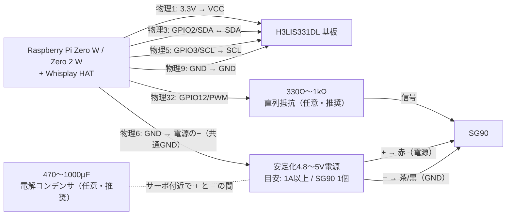

# もこ 配線ガイド — SG90サーボ & H3LIS331DL加速度センサー

対象: Raspberry Pi Zero W + PiSugar Whisplay HAT + PiSugarバッテリー構成の「もこ」

---

## 0. まず結論

| つなぐもの | Piの物理ピン |
|---|---|
| **H3LIS331DL** (加速度) | 3.3V=**1番** / GND=**9番** / SDA=**3番** / SCL=**5番** |
| **SG90** (サーボ) | 信号=**32番** / 電源=サーボ用4.8〜5V / GND=**6番**(+サーボ電源GNDと共通) |

> どちらも**ソフト側は対応済み**です。加速度センサーは挿せば10秒以内に自動認識（`もこ`再起動不要）、サーボは`servo.py`でテストできます。

### 配線図



> **重要:** 外部電源のプラス側は Raspberry Pi の5Vピンへ接続しません。接続するのはGND同士とPWM信号だけです。配線の抜き差しは、Piとサーボ電源を両方OFFにしてから行ってください。

---

## 1. 「画面が全ピンを覆ってる」問題の解決方法

Whisplay HATは40ピンヘッダーに直接かぶさりますが、**実際に信号を使っているのは約17本**で、残りは素通しです。取り出し方は3通り:

### 方法A: スタッキングヘッダーを間に挟む（おすすめ・はんだ最小限）
```
[Whisplay HAT]
    ↑ 差し込む
[2x20 スタッキングヘッダー]  ← ピンが長く、ここの横から線を取れる
    ↑ 差し込む
[Raspberry Pi Zero]
[PiSugar バッテリー]（裏面ポゴピン）
```
- 「**2x20 スタッキングヘッダー**（連結用・ピンヘッダー拡張）」で検索。数百円。
- HATと Pi の間にできる隙間で、必要なピンの根元にジャンパー線(メス)を挿すか、はんだ付け。
- 背が足りなければ2段重ねも可。

### 方法B: Pi Zero 裏面のはんだ面から直接取り出す
- Pi Zero の裏側にはヘッダーの**はんだ付け跡（スルーホール足）**が出ています。そこへ銅線・ジャンパ線を直接はんだ付け。
- ⚠️ 裏面には**PiSugarのポゴピン接点（金色の丸パッド）**があります。ショートしないよう接点付近を避け、はんだ後はカプトンテープ等で絶縁。

### 方法C: GPIO分岐基板（HAT Hacker系）
- 「HAT Hacker HAT」「GPIO Splitter」等、1つのGPIOを2系統に分岐する基板。工作は一番きれいだが入手性と厚みが難点。

### Q. 「間に銅線を引いてもいいの？」
**OKです。**ただし以下を守ってください:
- **I2C（3番・5番）の線は20cm以内**に。長いと通信エラーの原因（今回のセンサーは基板上にプルアップ抵抗があるのでそのまま繋ぐだけでOK）
- **GNDは必ず共通に**（センサーも、サーボの外部電源も、Pi のGNDと繋ぐ）
- サーボの**信号線**は長くても平気（1m程度まで問題なし）
- 被覆付きの線を使い、金属部が他のピンに触れないように

---

## 2. H3LIS331DL 加速度センサー

H3LIS331DLという名前はセンサーIC自体の型番です。以下の4本配線をそのまま使えるのは、**SparkFun SEN-14480**など、3.3V動作・I2C用に構成済みのブレークアウト基板です。手元の基板に `SEN-14480` の表記がない場合は、基板の製品ページまたは回路図も確認してください。

### 配線（4本だけ）
| SEN-14480側 | Pi側（物理ピン） | 備考 |
|---|---|---|
| 3V3 (VCC) | **1番** (3.3V) | ⚠️ **5Vに繋ぐと壊れます**（2.16〜3.6V専用） |
| GND | **9番** (GND) | 6/14/20/25番でも可 |
| SDA | **3番** (GPIO2/SDA) | Whisplay/PiSugarとバス共有でOK |
| SCL | **5番** (GPIO3/SCL) | 同上 |
| CS / SA0 / INT | SparkFun SEN-14480では接続不要 | 基板上の設定でI2Cモード、既定アドレス0x19 |

- I2Cアドレスは 0x18 または 0x19。**もこが両方自動スキャン**するので、SparkFun基板ではジャンパ変更不要。
- PiSugar (0x57/0x68) や音声コーデック (0x1a) とは衝突しません。

### SparkFun以外の基板・自作基板の場合

- H3LIS331DLの電源範囲は2.16〜3.6Vです。基板にレベル変換回路があると明記されていない限り、VCCとI/Oを5Vへ接続しないでください。
- I2Cを選ぶには `CS` を3.3V（Vdd_IO）へ固定します。`CS`を未接続のままにしてよいとは限りません。
- `SA0` を3.3Vにすると0x19、GNDにすると0x18です。未接続にはしません。
- PiのGPIO2/3には3.3Vへのプルアップがあります。基板にもプルアップがある場合は並列になるため、多数のI2C基板を追加するときは合成抵抗値を確認します。

### 接続確認
Raspberry Pi 上で確認します。

```bash
sudo i2cdetect -y 1        # 0x18 か 0x19 が現れればOK
sudo journalctl -u moko -f # センサー名がログに出れば認識済み
```
→ 本体を**振ると「もこ」がびっくり**します。

### ⚠️ このセンサーの特性（正直な話）
H3LIS331DL は **±100G〜400G の高衝撃測定用**（衝突・落下検出向け）です。分解能が約0.05G/目盛と粗く、**手で優しく揺らす検知はやや苦手**（強めに振れば反応します）。
- 感度が物足りなければ `~/Pi-Gottchi/app/imu.py` の `LIGHT`/`HARD` の `thresh` を下げて調整
- 繊細な揺れ検知をしたくなったら **MPU6050（GY-521、±2G、約200〜500円）** が最適。その場合は **AD0ピンを必ず3.3Vへ**（PiSugarのRTCとアドレス衝突を避けるため）。もこは両対応済み。

---

## 3. SG90 サーボモーター

### 配線
| SG90側（線色） | 接続先 |
|---|---|
| 信号（橙・黄・白のいずれか） | **32番** (BCM12)から330Ω〜1kΩを直列に介して接続 ※2個目は **33番** (BCM13) |
| 電源（赤） | **サーボ用の安定化4.8〜5V電源** |
| GND（茶または黒） | サーボ電源のマイナス。さらに **Piの6番** (GND) と結線 |

32/33番はWhisplay HATが使っていない**ハードウェアPWMピン**なので、カクつきなくサーボを動かせます。

信号線の直列抵抗は、正常動作のための必須部品ではありませんが、誤配線や信号線の短絡時にGPIOへ流れる電流を制限する保険になります。サーボの駆動電力は外部電源から供給されるため、この抵抗で通常トルクは低下しません。抵抗はPiのGPIOピンに近い位置へ入れます。

可能なら信号線とGNDの間へ10kΩ程度のプルダウンも追加します。Piの起動中、PWM未export時、異常終了時に信号線が浮いて意図せず動く可能性を減らせます。PWMをソフトウェアで `release()` しても電源や機械的な故障安全の代わりにはなりません。

### 有効化（初回のみ）
```bash
sudo nano /boot/firmware/config.txt    # 末尾に1行追記
```
```
dtoverlay=pwm-2chan,pin=12,func=4,pin2=13,func2=4
```
```bash
sudo reboot
```

### テスト
`app` ディレクトリで実行します。

```bash
cd ~/Pi-Gottchi/app
sudo python3 servo.py   # 90→75→105→90度の狭い範囲だけを確認
```

最初のテストではホーン（腕）や負荷を外し、すぐ電源を切れる状態で実行してください。端で唸る、震える、止まる場合は直ちに中止します。SG90互換品は個体差が大きいため、必要なら `servo.py` の `MIN_NS` / `MAX_NS` をさらに狭めて校正します。現在の `MAX_NS=2.4ms` は実機で2.5ms時の端当たりを確認して狭めた値です。
プログラムからは:
```python
from servo import Servo
s = Servo(channel=0)   # 0=32番ピン, 1=33番ピン
s.angle(90)
s.close()
```

リアクション連動は無負荷テスト後に `app/.env` で有効化します。最初は既定の70〜110度を広げないでください。

```dotenv
SERVO_ENABLED=1
SERVO_MIN_ANGLE=70
SERVO_CENTER=90
SERVO_MAX_ANGLE=110
SERVO_SLEEP_ANGLE=80
SERVO_HOLD=0
```

詳細は[ハードウェア連動](../docs/HARDWARE_INTEGRATION.md)を参照してください。

### ⚠️ 電源の注意（いちばん大事）
- Raspberry Pi公式資料は、モーターをGPIOへ直接接続せず、モーターコントローラ等を使うよう注意しています。SG90は制御回路を内蔵したRCサーボなので**信号線だけ**はGPIOへ接続できますが、電源は別です。
- このPiSugar + Whisplay構成では、SG90の赤線をPiの**物理2/4番（5V）や3.3Vピンから給電しない**でください。始動・停止・拘束時の電流変動で電圧が落ち、Piの再起動、音声ノイズ、I2Cエラーの原因になります。
- **推奨**: SG90 1個につき余裕を見て1A以上を供給できる安定化4.8〜5V電源を使います。純正TowerPro SG90の公称動作電圧は4.8Vです。
- サーボの近くで電源とGNDの間に470〜1000µFの電解コンデンサを追加すると、瞬間的な電圧低下を緩和できます。極性（`+`/`−`）を逆にしないでください。
- サーボ電源のGNDとPiのGNDは必ず共通にします。ただし、サーボ電源のプラスはPiの5Vピンへ接続しません。

### PiSugar 3から給電する場合

PiSugar 3のポゴピン、5V Output Pad、拡張端子の5V、Raspberry Piの物理2/4番は、いずれも同じシステム5V系統につながります。したがってPiの5VピンからSG90へ接続すると、実質的にはPiSugar 3からサーボへ給電することになります。

PiSugar公式仕様ではPiSugar 3の出力は5V・最大2.5Aですが、これはPi Zero W、Whisplay、センサー、サーボを合わせた合計値です。SG90 1個を軽負荷で試す場合は、PiのヘッダーではなくPiSugar 3の拡張端子 `5V Output` / `GND` から分岐し、サーボ直近に470〜1000µFの電解コンデンサを入れる方法があります。ただし電源レールはPiと共有されたままなので、再起動、画面・音声ノイズ、I2Cエラーが出たら外部電源へ切り替えてください。

外部電源へ切り替える場合、外部電源のプラスはSG90だけへ接続し、PiSugar/Piの5Vとは接続しません。GNDだけを共通化します。また、PiSugarの `BAT` パッドは3〜4.2Vのバッテリー生電圧なので、SG90の4.8V電源として使用しません。

---

## 4. 外付けボタン

Whisplay のボタンは物理11番ピン（BCM17）が HIGH になると押下として扱われます。モーメンタリスイッチを並列に追加すると、コードを変更せずに第2ボタンとして使えます。

| 外付けボタン | 接続先 |
|---|---|
| 端子A | 物理1番ピン（3.3V） |
| 端子B | 物理11番ピン（BCM17） |

- 押している間だけ導通するモーメンタリスイッチを使ってください。トグルスイッチは使用しません。
- なでる、連打、長押しなど、HAT 上のボタンと同じ操作として扱われます。
- 誤動作する場合は配線を短くし、必要に応じて2本をツイストします。

## 5. CSI カメラを併用する場合

- カメラケーブルの抜き差しは必ず電源OFFで行ってください。
- Raspberry Pi Zero シリーズには、Zero 用の細い22ピンカメラケーブルが必要です。
- カメラ接続後に本体が起動しない場合は、ケーブルの向き、斜め挿し、カメラ基板裏の短絡を確認してください。

カメラを利用する機能は、このリポジトリの現在のアプリケーションには含まれていません。この節は同じ筐体・GPIO構成でカメラを併用する際の配線上の注意です。

---

## 6. ピン全体マップ（どこが空いているか）

```
        3.3V  1 ●  ● 2   5V     ← サーボ電源には使わない
   SDA(共有)  3 ●  ● 4   5V
   SCL(共有)  5 ●  ● 6   GND    ← サーボGND
  [HAT:RST]   7 ●  ● 8   (空き UART-TX)
        GND   9 ●  ● 10  (空き UART-RX)   ← 9番=センサーGND
  [HAT:BTN]  11 ●  ● 12  [HAT:I2S]
  [HAT:DC]   13 ●  ● 14  GND
  [HAT:BL]   15 ●  ● 16  [HAT:LED B]
       3.3V  17 ●  ● 18  [HAT:LED G]
  [HAT:SPI]  19 ●  ● 20  GND
  [HAT:SPI]  21 ●  ● 22  [HAT:LED R]
  [HAT:SPI]  23 ●  ● 24  [HAT:SPI]
        GND  25 ●  ● 26  (空き)
   (EEPROM)  27 ●  ● 28  (EEPROM・使わない)
     (空き)  29 ●  ● 30  GND
     (空き)  31 ●  ● 32  ★空き PWM0 ← サーボ1信号
 ★空き PWM1 33 ●  ● 34  GND
  [HAT:I2S]  35 ●  ● 36  (空き)
     (空き)  37 ●  ● 38  [HAT:I2S]
        GND  39 ●  ● 40  [HAT:I2S]
```
`[HAT:○○]` = Whisplay使用中 / `(空き)` = 自由に使える / I2C(3・5番)は**共有バス**なのでセンサー追加OK

---

## 7. トラブルシューティング

| 症状 | 確認すること |
|---|---|
| i2cdetectにセンサーが出ない | 配線4本の順番 / 3.3Vに繋いだか / SDA・SCL逆挿し |
| 揺らしても反応しない | journalのtickログで `imu=H3LIS331DL` になっているか / 強めに振る / imu.pyのthresh調整 |
| サーボがプルプル震える | `s.release()`で保持を切る / 電源不足（外部5Vへ） |
| サーボを動かすとPiが再起動 | 電源不足。外部5V+GND共通に変更 |
| Piが起動しなくなった | 配線を全部抜いて起動→1本ずつ戻して切り分け |

## 関連ドキュメント

- [セットアップ](../docs/SETUP.md)
- [設定とカスタマイズ](../docs/CONFIGURATION.md)
- [トラブルシューティング](../docs/TROUBLESHOOTING.md)

## 参考リンク
- [STMicroelectronics H3LIS331DLデータシート](https://www.st.com/resource/en/datasheet/h3lis331dl.pdf)
- [SparkFun H3LIS331DL Hookup Guide](https://learn.sparkfun.com/tutorials/h3lis331dl-accelerometer-breakout-hookup-guide/all)
- [SparkFun H3LIS331DL 製品ページ](https://www.sparkfun.com/sparkfun-triple-axis-accelerometer-breakout-h3lis331dl.html)
- [TowerPro SG90 製品仕様](https://towerpro.com.tw/product/sg90-analog/)
- [Raspberry Pi GPIO公式ドキュメント](https://www.raspberrypi.com/documentation/computers/raspberry-pi.html#gpio-and-the-40-pin-header)
- [PiSugar Whisplay HAT Docs](https://docs.pisugar.com/docs/product-wiki/whisplay/overview)
- [PiSugar 3 Series 公式仕様](https://docs.pisugar.com/docs/product-wiki/battery/pisugar3/pisugar-3-series)
